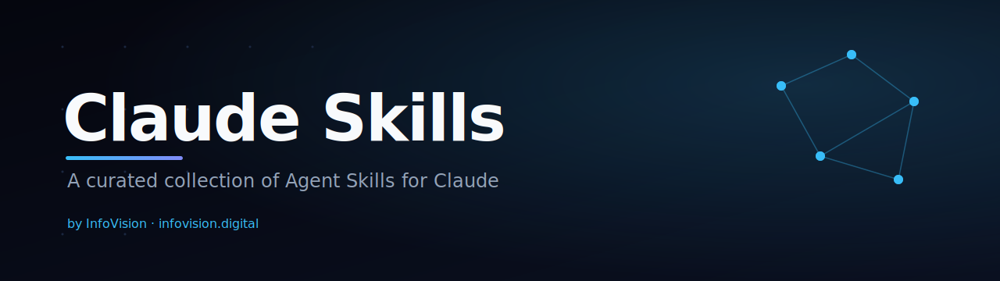

<p align="center">
  
</p>

<p align="center">
  <a href="./LICENSE"></a>
  
  
  
  <a href="./CONTRIBUTING.md"></a>
</p>

<p align="center">
  A hand-picked set of <b>Agent Skills</b> that give Claude specialist expertise in advertising, SEO, sales, design, and writing.<br>
  Drop one into Claude and it knows how to run a full Meta audit, score an Instagram profile, or strip AI tells from your copy — on demand.
</p>

---

## What's in here

Each folder under [`skills/`](./skills) is a **self-contained Agent Skill**: a `SKILL.md` with YAML frontmatter (plus any reference files or scripts it needs). Claude loads a skill only when the task calls for it, so you can keep the whole set installed without cluttering ordinary conversations.

### 📣 Advertising & Growth

| Skill | What it does |
|---|---|
| [**meta-ads-live-audit**](./skills/meta-ads-live-audit) | Pulls **live** Meta (FB/IG) ad data via MCP and opens the real creatives in Chrome, then delivers a full funnel-based account audit with a prioritized action plan. Strictly read-only. |
| [**meta-ads-analysis**](./skills/meta-ads-analysis) | Turns pasted Meta Ads data (CSV / screenshot / text) into a strategic breakdown — ROAS, CTR, CPC, funnel diagnosis, benchmarks, and next moves. |
| [**instagram-account-audit**](./skills/instagram-account-audit) | Audits any Instagram account from just a handle or link and returns a **0–10 growth score** with fixes across profile, content, Reels, and engagement. |

### 🔍 SEO & Content

| Skill | What it does |
|---|---|
| [**seo-ai-audit**](./skills/seo-ai-audit) | A full SEO **and** AI-search audit — visibility across Google *and* AI engines (ChatGPT, Gemini, Perplexity), keyword clusters, content gaps, and competitor insights. |

### 💼 Sales

| Skill | What it does |
|---|---|
| [**lead-filter**](./skills/lead-filter) | Lead intelligence: analyze and qualify leads, decide what to pitch each one, and generate outreach — email, WhatsApp, and cold-call scripts. |

### 🎨 Design & Engineering

| Skill | What it does |
|---|---|
| [**ui-ux-pro-max**](./skills/ui-ux-pro-max) | UI/UX design intelligence — 50+ styles, 161 palettes, 57 font pairings across 10 stacks (React, Next.js, Vue, Svelte, SwiftUI, Flutter, Tailwind, shadcn/ui…). Plan, build, review, and refine interfaces. |

### ✍️ Writing

| Skill | What it does |
|---|---|
| [**stop-slop**](./skills/stop-slop) | Strips predictable AI tells from prose while drafting, editing, or reviewing. *Authored by [Hardik Pandya](https://hvpandya.com) — see [Credits](#credits--attribution).* |

---

## Using a skill

These follow Anthropic's [Agent Skills](https://docs.claude.com/en/docs/agents-and-tools/agent-skills) format, so they work anywhere Claude reads skills.

**1. Get the files**

```bash
git clone https://github.com/shivam-9090/claude-skills.git
cd claude-skills
```

**2. Add a skill to Claude**

- **Claude Code / Cowork** — copy the skill folder into your skills directory (e.g. a project's `.claude/skills/` or your personal skills folder). Claude picks it up automatically.
  ```bash
  cp -r skills/meta-ads-live-audit ~/.claude/skills/
  ```
- **Claude apps (web / desktop)** — zip a skill folder into a `.skill` file and upload it in **Settings → Capabilities → Skills** (where skill creation is enabled for your account).
  ```bash
  cd skills && zip -r meta-ads-live-audit.skill meta-ads-live-audit
  ```

**3. Use it** — just describe the task. Claude triggers the matching skill on its own. For example: *"run a full audit on my Meta account"*, *"score this Instagram profile"*, or *"clean the AI tells out of this draft."*

> Exact menu paths in the Claude apps change over time — if something's moved, check the [official docs](https://docs.claude.com/en/docs/agents-and-tools/agent-skills).

---

## Repository layout

```
claude-skills/
├── README.md
├── LICENSE
├── CONTRIBUTING.md
├── assets/
│   └── banner.svg
└── skills/
    ├── instagram-account-audit/
    ├── lead-filter/
    ├── meta-ads-analysis/
    ├── meta-ads-live-audit/
    │   ├── SKILL.md
    │   └── references/benchmarks.md
    ├── seo-ai-audit/
    ├── stop-slop/
    └── ui-ux-pro-max/
```

---

## Contributing

Ideas, fixes, and new skills are welcome — see [CONTRIBUTING.md](./CONTRIBUTING.md) for the skill format and PR checklist.

## Credits & attribution

Most skills here are built and maintained by **Shivam / [InfoVision](https://infovision.digital)**. Some are curated from the wider Claude community and remain the work of their original authors:

- **stop-slop** — by [Hardik Pandya](https://hvpandya.com).

If you're an author of a bundled skill and want a change in credit or removal, open an issue. If you're reusing a skill from this repo, keep the original author's attribution and check that skill's own licensing before redistributing.

## License

Original skills in this repository are released under the [MIT License](./LICENSE). Third-party skills retain the rights and licensing of their original authors — see [Credits](#credits--attribution).

<p align="center"><sub>Built with Claude · curated by <a href="https://infovision.digital">InfoVision</a></sub></p>
